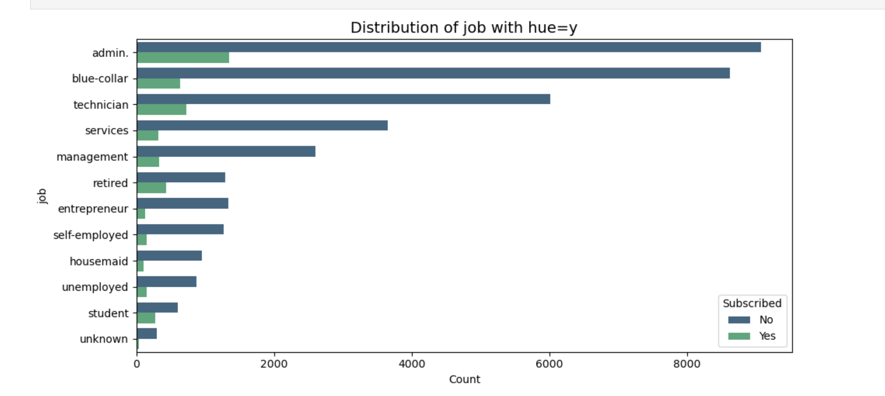
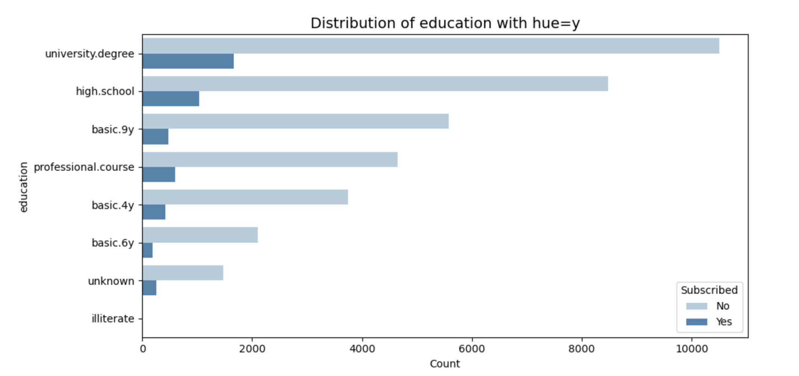
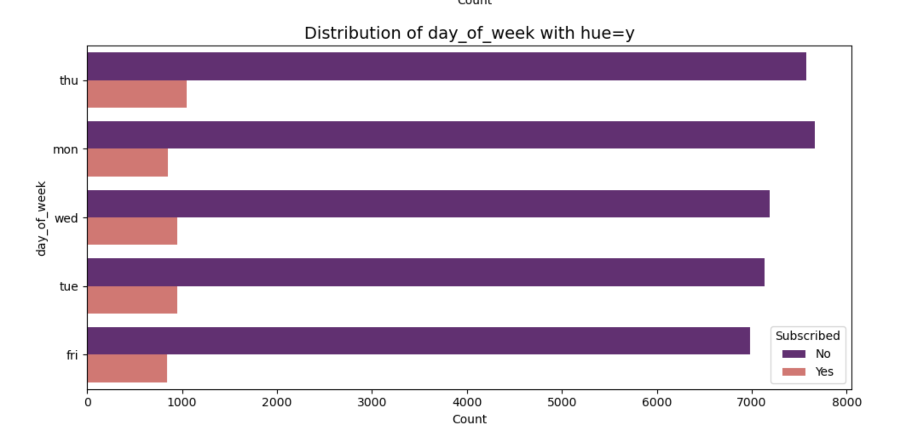
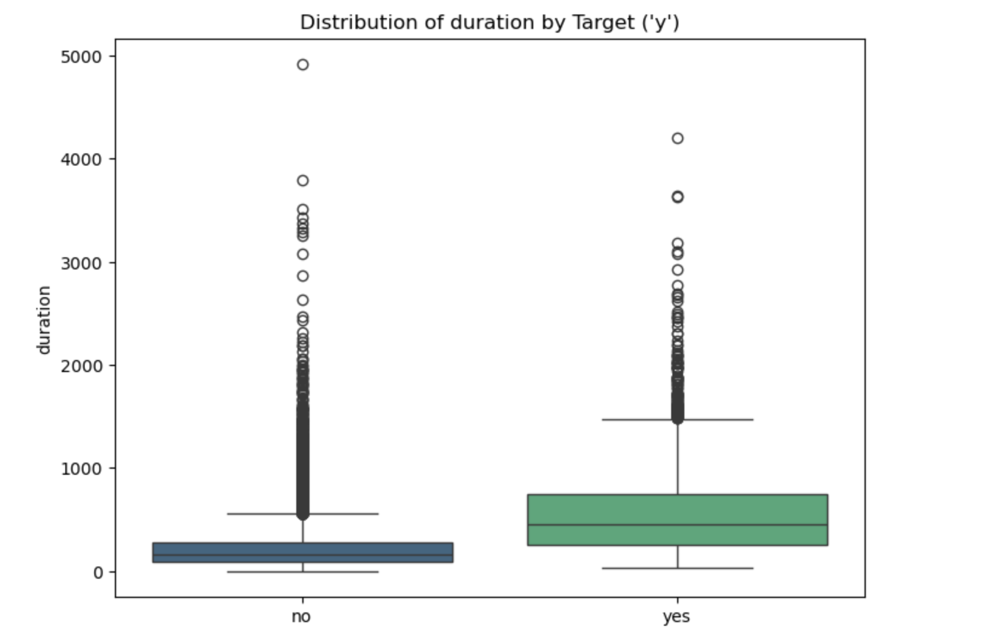
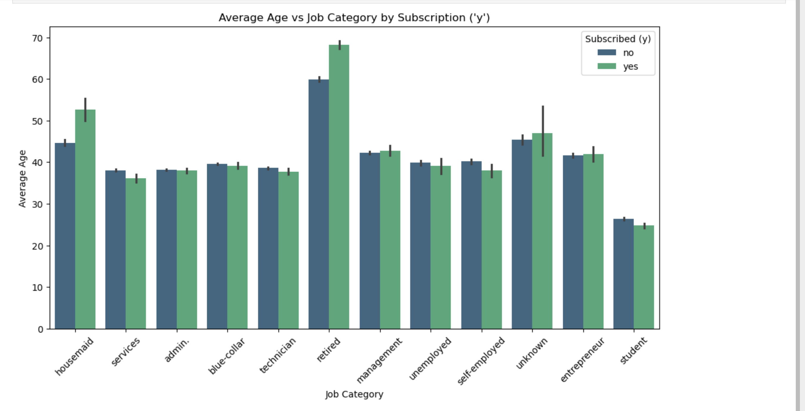
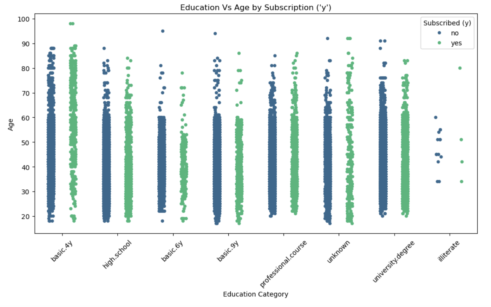
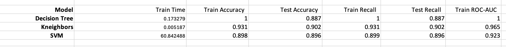
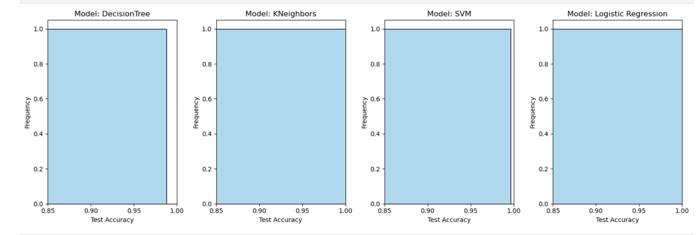
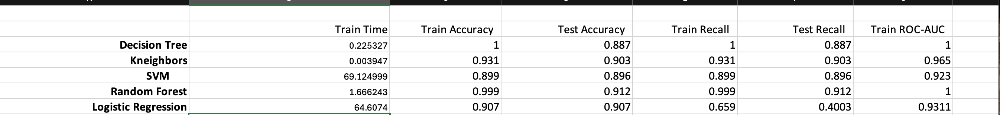
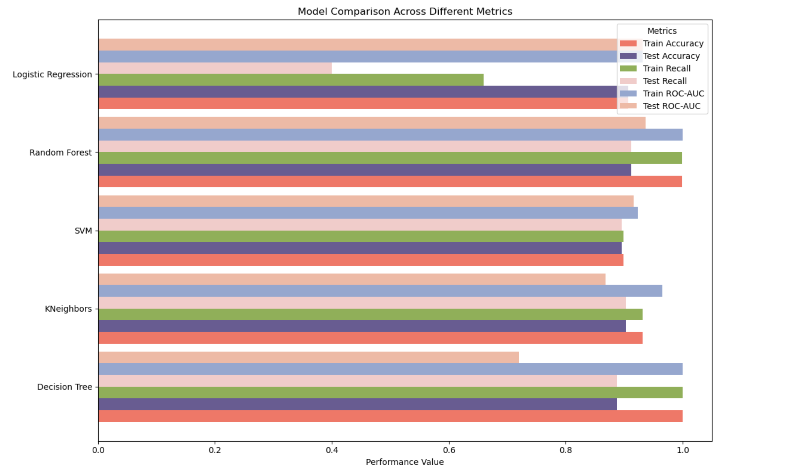

#MarketingCampaignSubscription

##Overview :

In this application, we explore a dataset from UCI Machine Learning Repository . The provided dataset [Bank Marketing Dataset](https://archive.ics.uci.edu/ml/datasets/Bank+Marketing) is related with direct marketing campaigns (phone calls) of a Portuguese banking institution. The classification goal is to predict if the client will subscribe a term deposit (variable y). This involves understanding customer behavior and campaign effectiveness. Various machine learning models such as Logistic Regression, SVM, Decision Tree, and KNN will be applied to build predictive models. The performance of these models will be evaluated to identify the best approach for accurate predictions.

### Dataset

#####Bank Client Information :
* age: The age of the client (numeric).
* job: The type of job the client has (e.g., admin, technician).
* marital: Marital status of the client (e.g., married, single).
* education: The highest level of education achieved by the client.
* default: Indicates if the client has credit in default (binary: "yes" or "no").
* housing: Indicates if the client has a housing loan (binary: "yes" or "no").
* loan: Indicates if the client has a personal loan (binary: "yes" or "no")

#####Campaign-Related Information
* contact: The type of communication used to contact the client (e.g., cellular, telephone).
* month: The last month of the year when the client was contacted.
* day_of_week: The day of the week when the client was last contacted.
* duration: The duration of the last call in seconds. (Highly predictive but only known after the call)
* campaign: The number of contacts performed during the current campaign.
* pdays: The number of days since the client was last contacted (-1 means never contacted before).
* previous: The number of contacts performed before the current campaign.
* poutcome: Outcome of the previous marketing campaign (e.g., success, failure).

#####Economic Indicators
* emp.var.rate: Employment variation rate (quarterly indicator).
* cons.price.idx: Consumer price index (monthly indicator).
* cons.conf.idx: Consumer confidence index (monthly indicator).
* euribor3m: 3-month Euribor interest rate.
* nr.employed: Number of employees in the bank (quarterly indicator).

### Files 

* prompt_III.ipynb: The Jupyter Notebook containing the complete analysis, data preparation, modeling, and evaluation process.
* bank-additional-full.csv: The dataset used for training and testing the machine learning models.

### Data Understanding :

* Load the dataset
* Check data type of the columns and dimensions of the dataframe
* Check the null values and duplicate rows
* Remove duplicate rows
* Dataset contains categorical data
* The target variable 'y' indicates whether a customer subscribed to a term deposit ('yes') or not ('no'). It is a binary classification variable with two possible outcomes: 'yes' and 'no'.

### Data Preparation :

* Covert target 'y' to 'y_numeric' mapping 'yes' to '1' and 'no' to '0'
* All categorical columns were one-hot encoded to transform data into numerical format for machine learning model
* Generate a int columns for each unique category, allowing the model to interpret these features as separate variables with values 0 or 1.
* The encoded features enhance the model’s ability to capture the impact of these attributes on campaign prediction.
* Calculate IQR for age, campaign, duration and remove outliers
* Univariate Analysis
     -  Plots
    
    
    
    
    
* Bivariate Analysis
     - Plots 
            * Age  vs. job: 
     
            * education vs. age: 
      
     
*  The heatmap visually represents the correlation between the selected variables with values ranging from -1 to 1, where darker colors indicate stronger correlations and lighter colors represent weaker correlations.   
        
       
     

## Modeling :
#### Baseline model
#####DummyClassifier :
* Baseline accuracy: 0.884724358455436
* Predictions: [0 0 0 0 0 0 0 0 0 0]
* Recall for class 0: 1.0
* Recall for class 1: 0.0

#####SVC:
* Predictions: [0 0 0 ... 0 0 0]
* Accuracy: 0.896381445802639
* Recall for class 0: 0.9839875560435538
* Recall for class 1: 0.22401685393258428

####Simple model without params definition
        *Model performance
 
              
#####Logistic regression

* Total execution time: -0.50 seconds
* Logistic Regression Train Accuracy: 0.9128
* Logistic Regression Test Accuracy: 0.9081
* Train Precision for Logictics Regression: 0.6698888351860802
* Test Precision for Logictics Regression: 0.664391353811149
* TrainRecall for Logictics Regression: 0.431104199066874
* Test Recall for Logictics Regression: 0.4101123595505618
* Train F1-Score for Logictics Regression: 0.5246025738077215
* Test F1-Score for Logictics Regression: 0.5071645679548415

* Classification Report (Test Set):
*              precision    recall  f1-score   support
* 
*            0       0.93      0.97      0.95     10929
*            1       0.66      0.41      0.51      1424
* 
*     accuracy                           0.91     12353
*    macro avg       0.80      0.69      0.73     12353
* weighted avg       0.90      0.91      0.90     12353

* Classification Report (Train Set):
*              precision    recall  f1-score   support
* 
*            0       0.93      0.97      0.95     25608
*            1       0.67      0.43      0.52      3215
* 
*     accuracy                           0.91     28823
*   macro avg       0.80      0.70      0.74     28823
* weighted avg       0.90      0.91      0.90     28823

##### Model comparison
 
 
####Models with params
Additional hyperparameters to tune and explore models.  
* Training DecisionTree with parameters: {'random_state': 42, 'max_depth': None}  
* Training KNeighbors with parameters: {'n_neighbors': 5, 'weights': 'uniform'}  
* Training SVM with parameters: {'kernel': 'rbf', 'C': 1.0, 'random_state': 42}  
* Training RandomForest with parameters: {'n_estimators': 100, 'max_depth': None, 'random_state': 42}  
* Training Logistic regression with parameters:  
* param_grid = { 'C': [0.1, 1.0, 10],             
                 # Regularization strength  
                 'solver': ['lbfgs', 'liblinear'],  # Solvers compatible with binary classification  
                 'penalty': ['l2'],                # L2 regularization  
                 'class_weight': [None, 'balanced']  # Handle class imbalance  
                }  
##### grid search  
grid_search = GridSearchCV(  
                          estimator=logistic_regression_model,  
                          param_grid=param_grid,  
                          scoring='roc_auc',  # Use ROC-AUC for binary classification  
                          cv=3,               # 3-fold cross-validation  
                          n_jobs=-1,          # Use all available CPU cores  
                          verbose=0           # No detailed logs for a clean output  
 }  

#####Model performance
 
 
##### Model comparison
 
 
### Performance Analysis :
#####1. Decision Tree
• Train Time: 0.17 seconds  
• Train Accuracy: 100% (1.000)  
• Test Accuracy: 88.75% (0.887)  
• Train Recall: 100% (1.000)  
• Test Recall: 88.75% (0.887)  
• Train ROC-AUC: 1.000  
• Test ROC-AUC: 0.720  
Analysis:  
•	The Decision Tree model has overfitted to the training data (perfect train accuracy and recall, but significantly lower test performance).   This is visible in the drop in accuracy and recall from the training set to the test set.  
•	The ROC-AUC on the test set is also relatively low (0.720), indicating that while the model is good at classifying   training data, it struggles on unseen data. 

#####2. KNeighbors
•	Train Time: 0.006 seconds  
•	Train Accuracy: 93.14% (0.931)  
•	Test Accuracy: 90.28% (0.903)  
•	Train Recall: 93.14% (0.931)  
•	Test Recall: 90.28% (0.903)  
•	Train ROC-AUC: 0.965  
•	Test ROC-AUC: 0.868  
Analysis:  
•	KNeighbors performs well with minimal training time. It has a small drop in accuracy and recall between the train and test   sets, which suggests it generalizes better than the Decision Tree.  
•	The ROC-AUC score for the test set is 0.868, which is fairly strong, suggesting that the model is effective at   distinguishing between classes.  

#####3. SVM (Support Vector Machine)
•	Train Time: 64.34 seconds (quite high)  
•	Train Accuracy: 89.86% (0.899)  
•	Test Accuracy: 89.64% (0.896)  
•	Train Recall: 89.86% (0.899)  
•	Test Recall: 89.64% (0.896)  
•	Train ROC-AUC: 0.923  
•	Test ROC-AUC: 0.916  
Analysis: 
•	SVM is relatively slow to train, which is expected with larger datasets or certain kernel types (e.g., RBF). 
•	However, the model is very consistent, with nearly equal performance on both the training and test sets. This suggests   that the SVM is well-regularized and generalizes well to unseen data.  
•	The high ROC-AUC (0.916) indicates excellent performance, particularly for binary classification tasks. 

#####4. Random Forest
•	Train Time: 1.70 seconds  
•	Train Accuracy: 99.99% (0.999)  
•	Test Accuracy: 91.17% (0.912)  
•	Train Recall: 99.99% (0.999)  
•	Test Recall: 91.17% (0.912)  
•	Train ROC-AUC: 1.000  
•	Test ROC-AUC: 0.937  
Analysis:  
•	Like the Decision Tree, Random Forest shows perfect performance on the training set, but with a much smaller drop in test accuracy (91.17%). 
•	The test ROC-AUC score of 0.937 is very high, indicating strong discriminatory power and generalization on unseen data. 
•	Random Forest seems to be the most robust model, combining strong performance and reasonable training time. 

## Comparison Summary

•	Best for Accuracy: Random Forest (91.17% test accuracy).  
•	Best for Recall: Random Forest (91.17% test recall).  
•	Best for ROC-AUC: Random Forest (0.937 test ROC-AUC).  
•	Best for Training Speed: KNeighbors (0.006 seconds).  

    
  

